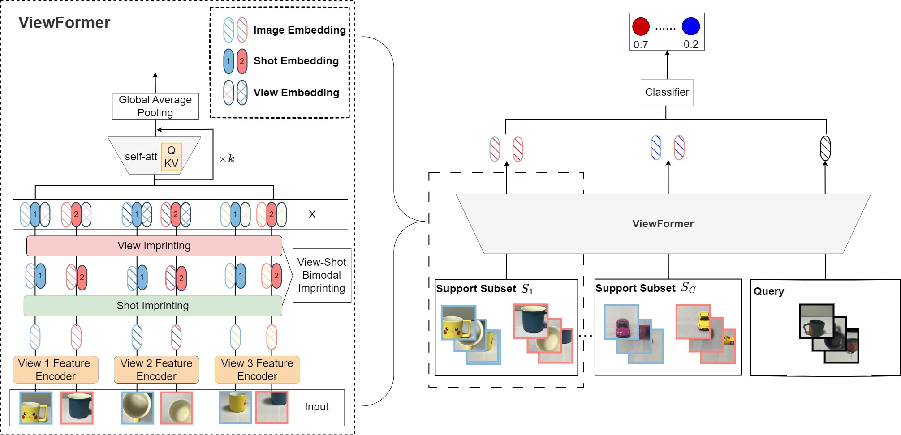

# **ViewFormer**

This is the PyTorch Implementation for our paper:

ViewFormer:multi-view few-shot learning based on transformer

Jing Liu, Xi Wang, Limin Li




## `Requirements`

    python                                               3.6 
    CUDA Version                                         10.0.130
    Pytorch                                              1.7.0
    torchvision                                          0.8.1
    timm                                                 0.4.9
    Pillow                                               8.1.0
    opencv-contrib-python                                4.5.2.52
 


## Multi-View Few-shot Learning 

For the Multi-View Few-shot Learning task, we are given a set of samples with multiple views. 
During training, only samples of a subset of support set are available. 
For testing, the model is tested on samples of unseen (novel) class. We evaluate ViewFormer on three datasets, 
MVset, Caltech-20 and NUS-WIDE-OBJECT. 


### Data Statistics


To train the model, you can simply run
```angular2html
python train.py --model  MULT  --when 1 --num_epochs 10  --train_num 150 --val_num 100 --test_num 100   --name ViewFormer --lr 1.0e-04 --num_heads 64  --nlevels 6  --shot 5 --model_root ./model   --lamda 1 --beta 0.1  --view_encoding --shot_encoding
```
For testing, 
```angular2html
python test_proto.py --model MULT  --test_num 100   --name ViewFormer --num_heads 64  --nlevels 6  --shot 1  --view_encoding --shot_encoding
python test_LR.py --model MULT  --test_num 100   --name ViewFormer --num_heads 64  --nlevels 6  --shot 1  --view_encoding --shot_encoding
```

